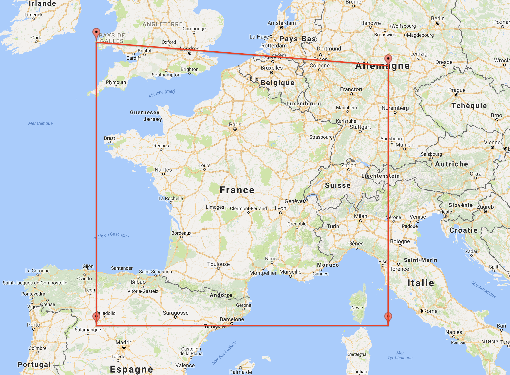
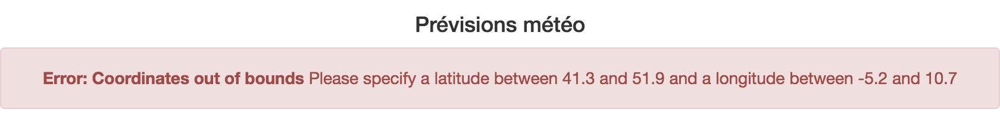
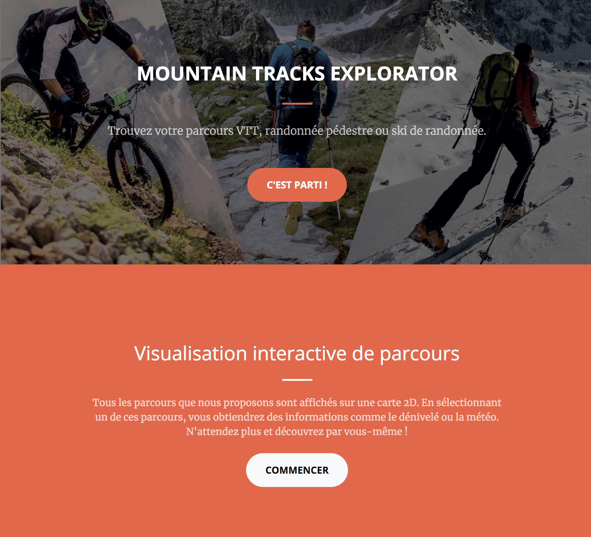
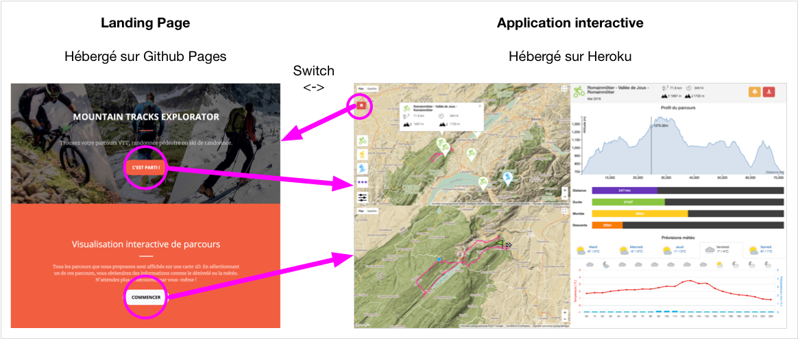
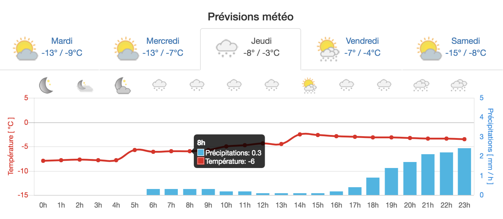
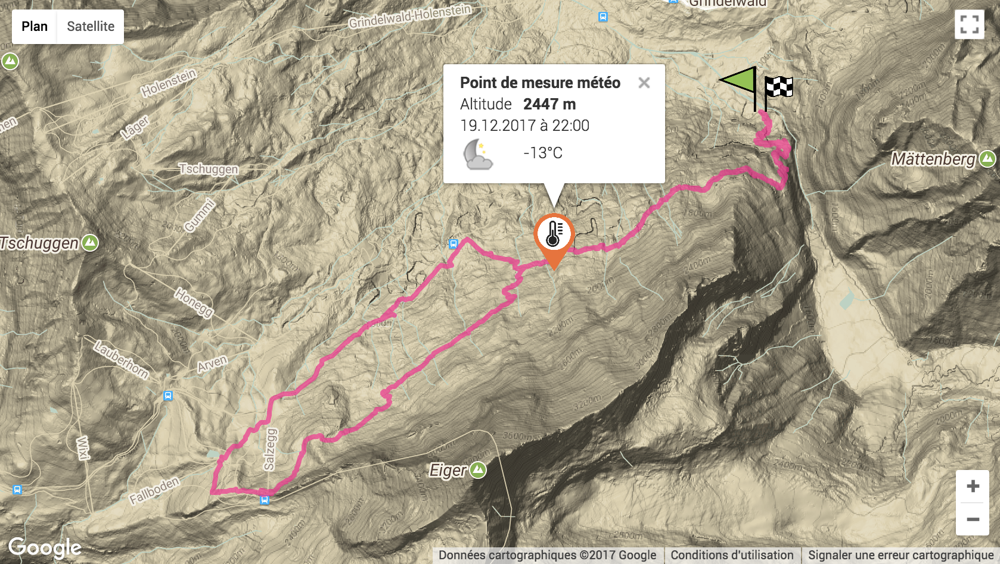

# Mountain Tracks Explorator

*Projet effectué durant le cours VI de octobre à décembre 2017*

---

**Il est conseillé de visualiser l'application en même temps que la lecture de ce document**

- Landing page : [https://sebastienrichoz.github.io/MSE_VI/](https://sebastienrichoz.github.io/MSE_VI/)
- Lien direct vers l'application : [https://mountain-tracks-explorator.herokuapp.com/](https://mountain-tracks-explorator.herokuapp.com/)

---

**Groupe**
- Antoine Drabble <antoine.drabble@master.hes-so.ch>
- Sébastien Richoz <sebastien.richoz@master.hes-so.ch>

**Public cible** : Toute personne à la recherche d’activités en montagne

**Intention/objectif** : Aider les personnes à la recherche d’activités en montagne à trouver des parcours (VTT, randonnée, ski, ...) en les explorant sur une carte en 2D.

**Source de données** : la montre à Sébastien (fichiers GPX) + https://www.prevision-meteo.ch/services pour les données météo.

**Technologies** : Javascript & HTML & CSS

**Court descriptif** :  Visualisation des parcours à l’aide de l’API de Google Maps avec détails de ceux-ci (profil altimétrique, distance...).

# Table des matières

1. [Introduction](#introduction)
2. [Etat de l'art](#%C3%89tat-de-lart)
3. [Conception](#conception)
   - [Technologies](#technologies)
   - [Source et format des données](#source-et-format-des-donn%C3%A9es)
   - [Architecture](#architecture-mvc)
4. [Réalisation](#r%C3%A9alisation)
   - [Présentation de l'application](#pr%C3%A9sentation-de-lapplication)
   - [Les 3 parties de l'application](#les-3-parties-de-lapplication)
   - [Responsive Design](#responsive-design)
   - [Support des différents navigateurs](#support-des-diff%C3%A9rents-navigateurs)
   - [Filtrage des parcours](#filtrage-des-parcours)
   - [Choix des couleurs](#choix-des-couleurs)
   - [Graphique du profil altimétrique](#graphique-du-profil-altim%C3%A9trique)
   - [Graphique des prévisions météos](#graphique-des-pr%C3%A9visions-m%C3%A9t%C3%A9o)
5. [Critiques](#critiques)
6. [Conclusion](#conclusion)
7. [Installation](#installation)
8. [Mode d'emploi](#mode-demploi)

## Introduction

Ce travail a pour but de réaliser une interface web interactive pour la recherche d’activités en montagne (VTT, randonnée, ski de randonnée) avec des fonctionnalités adaptées à ce genre de pratiques :

- Visualisation des parcours sur une carte
- Affichage du profil altimétrique du parcours
- Possibilité d’exporter le parcours au format GPX pour sa montre/smartphone ou de l'imprimer.
- etc.

L'idée consiste à répondre aux besoins d'utilisateurs voulant choisir et se préparer à une activité sportive avant de la pratiquer. Nous considérons que ces personnes se préparent entre une heure et cinq jours avant le début de leur activité.

L'application permettra de filtrer les activités et d’obtenir des informations détaillées sur chacune d’elles tout en gardant une visualisation générale afin de pouvoir rapidement changer de parcours.

Voici un aperçu de l'application:


## État de l'art

Il existe déjà beaucoup d'applications offrant ce genre de fonctionnalités. Parmi elles nous distinguons deux grandes catégories : les préparateurs de parcours et les traqueurs d'activité.

Les préparateurs de parcours concernent la phase se déroulant **avant** l'activité à savoir la recherche de parcours, l'organisation, la préparation à celui-ci, etc. Suisse Mobile (http://www.schweizmobil.ch/fr/hiver.html) en fait partie. Ces applications affichent les mêmes données pour tous les utilisateurs.

Les traqueurs d'activité concernent quant à eux la phase se déroulant **après** l'activité à savoir la visualisation de son parcours et de ses performances (vitesse, temps de course par exemple). Ce sont des applications affichant des données spécifiques à chaque utilisateur. Garmin, Polar, Fitbit, Strava sont des exemples de traqueurs d'activité qui disposent d'une application mobile ou d'une montre adaptée pour la récolte de données.

Le projet développé durant ce cours entre dans la catégorie des préparateurs de parcours. Les solutions trouvées sur le web sont à notre goût incomplètes au niveau du regroupement des informations : certaines manquent ou sont incomplètes et d'autres sont de trop. De plus, il faut souvent cliquer sur plusieurs boutons/liens avant d'arriver à l'information souhaitée. Finalement l'utilisateur se perd et est contraint de récolter l'informations sur plusieurs sites web afin de préparer correctement son parcours.

À la différence de ces solutions, Mountain Tracks Explorator se veut plus pertinent, selon nous, vis-à-vis de la présentation des données nécessaires à une préparation minimale mais complète d'un parcours en montagne, tout en accédant en un minimum d'étape à l'information souhaitée.

## Conception

La phase de conception décrit les technologies utilisées, la source et le format des données, ainsi que l'architecture de l'application.

### Technologies

Ci-dessous sont présentées les technologies utilisées à l'élaboration de la visualisation.

#### HTML5, CSS3 et Javascript
Nous avons utilisé HTML5, CSS3 et Javascript afin d'avoir un développement simple et efficace ainsi que l'accès à beaucoup de librairies très utiles.


#### Google Maps

L'application utilise l'[API](https://developers.google.com/maps/?hl=fr) javascript de Google Maps afin d'afficher la carte, les tracés etc.
Nous avons hésité entre l'utilisation de Google Maps et de Open Street Maps. Ayant de meilleures connaissances dans l'utilisation de Google Maps nous avons décidé de commencer par ça. Nous aimerions bien ajouté la possibilité de choisir Open Street Maps pour l'affichage de différents calques (privilégiant le relief ou la vision satellite par exemple) selon les envies de l'utilisateur.


#### jQuery

Nous avons utilisé la librairie [jQuery](https://jquery.com/). Elle permet de manipuler facilement les objets du DOM et nous a donc simplifier la tâche plutôt que d'avoir tout écrit en Javascript.

#### jQuery UI

Nous avons utilisé la librairie [jQuery UI](https://jqueryui.com/) afin d'afficher les sliders permettant de chosir les valeurs minimales et maximales des filtres.


#### Bootstrap

Nous avons utilisé [Bootstrap](https://getbootstrap.com/) pour certaines parties de la mise en page.


#### ChartJS

Nous avons utilisé [Chartjs](http://www.chartjs.org/) pour l'affichage des graphiques de la météo.


#### D3.js

Nous avons utilisé [D3.js](https://d3js.org/) pour l'affichage du graphique du profil altimétrique.


### Source et format des données
Deux différentes sources de données ont été utilisées : une pour les parcours et l'autre pour les prévisions météo.

#### Les parcours

Les parcours sont stockés dans des fichiers GPX (GPS eXchange Format). Ce sont des fichiers au format XML qui contiennent plusieurs informations dont une liste de points qui représentent le parcours. Chaque point contient une latitude, une longitude, une altitude et un temps.

Voici un exemple de fichier GPX.

```xml
<?xml version="1.0" encoding="UTF-8"?>
<gpx xmlns="http://www.topografix.com/GPX/1/1" version="1.1" creator="Polar Flow">
  <trk>
      <name>L'Isle - Croix</name>
      <type>mtb</type>

      <trkseg>
        <trkpt lat="46.61722967" lon="6.41248367">
          <ele>676.0</ele>
          <time>2017-09-10T18:12:53.000Z</time>
        </trkpt>
        <trkpt lat="46.61722967" lon="6.41248367">
          <ele>676.0</ele>
          <time>2017-09-10T18:12:54.000Z</time>
        </trkpt>
        <trkpt lat="46.61725133" lon="6.41251817">
          <ele>675.0</ele>
          <time>2017-09-10T18:12:55.000Z</time>
        </trkpt>
        <trkpt lat="46.617277" lon="6.41254933">
          <ele>673.0</ele>
          <time>2017-09-10T18:12:56.000Z</time>
        </trkpt>

        [...]

      </trkseg>
  </trk>
</gpx>
```

Description des balises utilisées :

- `<trk>` contient les informations sur le parcours
  - `<name>` est le nom résumant le parcours
  - `<type>` permet de différencier les trois types de parcours à savoir **mtb | hiking | skitouring**
  - `<trkseg>` contient les les points du parcours, appelés "trackpoints".
    - `<trkpt>` possède l'attribut `lat` et `lon` pour la latitude et la longitude.
      - `<ele>` est l'altitude.
      - `<time>` est le temps auquel le "trackpoint" a été mesuré

##### Filtrage des données GPX

Il existe encore d'autres balises qui viennent compléter le format GPX mais nous n'en avons pas besoin. Seuls le nom et le type du parcours ainsi que tous les "trackpoints" avec leur latitude, longitude et altitude nous sont utiles pour la représentation des parcours.

Le nombre de "trackpoints" est également conséquent (un point mesuré toutes les secondes) et alourdit l'application. Dans l'état des choses, tous les points sont pris en compte bien que seulement un dixième aurait suffit. La visualisation reste pour le moment agréable étant donnée du petit nombre de parcours présentés (une dizaine). À l'avenir il serait indispensable de ne représenter qu'un faible pourcentage de ces points pour des raisons de performance et obtenir ainsi une interaction toujours très réactive.

#### Prévisions météo

Les prévisions météo ont été récoltées sur l'API publique et gratuite de [https://www.prevision-meteo.ch/services](https://www.prevision-meteo.ch/services). La requête consiste à fournir un point GPS (lat + lon) et retourne un objet JSON contenant les prévisions météo détaillées du jour J0 (jour courant) au jour J+4.

L'objet JSON est très complet. Pour simplifier, seules les données utilisées sont décrites :

```javascript
{
  // Altitude du point de mesure
  "forecast_info": {
    "elevation": "725.44"
  },

  // Conditions actuelles
  "current_condition": {
    "date": "19.12.2017",
    "hour": "19:00",
    "tmp": -6, // Température en °C
    "condition": "Nuit nuageuse",
    "icon": "https://www.prevision-meteo.ch/style/images/icon/nuit-nuageuse.png",
  },

  // Prévisions du jour actuel
  "fcst_day_0": {
    "date": "19.12.2017",
    "day_long": "Mardi",
    "tmin": -7, // Température minimum en °C
    "tmax": -1, // Température maximum en °C
    "icon": "https://www.prevision-meteo.ch/style/images/icon/stratus-se-dissipant.png",

    // Prévision pour chaque heure de la journée
    "hourly_data": {
      "0H00": {
        "ICON": "https://www.prevision-meteo.ch/style/images/icon/nuit-claire-et-stratus.png",
        "TMP2m": -6.5, // Température [°C]
        "APCPsfc": 0, // Précipitations [mm] (pluie)
      },
      // ...
      "23H00": { /*... */ }
    }
  },

  // Prévisions des jours suivants
  "fcst_day_1" : { /* ... */ },
  "fcst_day_2" : { /* ... */ },
  "fcst_day_3" : { /* ... */ },
  "fcst_day_4" : { /* ... */ }
}
```

L' API limite la latitude entre 41.3 et 51.9 et la longitude entre -5.2 and 10.7 ce qui correspond au fenêtrage suivant :



Si un parcours se trouve en dehors de cette zone, la météo ne pourra pas être récupérée et l'application retournera un message d'erreur en lieu et place du graphe des prévisions météo :



### Architecture MVC

HTML pour la vue, CSS pour la mise en forme, JavaScript pour les controlleurs et les fichiers .gpx comme modèles.

## Réalisation

Cette phase décrit comment les données ont été traitées et affichées à l'utilisateur

- Filtrage des .gpx
    - calcul du dénivelé (tout les t secondes sinon imprécis)
    - profil altimétrique (tout les t secondes sinon trop précis et lent)
- Estimation de la durée (ce n'est qu'une estimation!)
- screenshot final de la visu

### Présentation de l'application

Lorsqu'un utilisateur découvre l'application pour la première fois il ne comprend pas forcément tout de suite ce qu'elle permet de faire. De plus, elle ne contient pas de barre de titre ni de descriptif permettant d'en savoir plus, l'objectif étant de maximiser l'espace disponible avec les cartes et les graphiques amenant des informations plus riches au véritable problème.

C'est pourquoi nous avons créé une page de présentation séparée totalement de l'application qui fournit les informations nécessaires à la mise en contexte de l'utilisateur vis-à-vis du problème permettant également de provoquer l'envie d'utiliser l'outil au moyen d'une visualisation attirante. C'est un concept très souvent utilisé qui porte le terme de "landing page" et qui redirige l'utilisateur sur l'application s'il désire la découvrir.



La photo en background identifie les trois types d'activités. La landing page a été réalisée avec un thème gratuit bootstrap https://startbootstrap.com/template-overviews/creative/ .

Il est possible de passer de la landing page à l'application interactive et vice-versa.



Ainsi nous obtenons une navigation cohérente et une manière de mettre l'utilisateur dans le contexte de l'application.

### Les 3 parties de l'application

Nous avons essayé de suivre les 7 étapes du mantra de la visualisation selon Ben Schneidermann en divisant l'application en 3 parties.

La première qui est affichée en plein écran lorsque l'application est ouverte est une carte Google Maps. Cette carte affiche tous les parcours avec des marqueurs ayant comme image le type du parcours et une couleur distincte des autres types. Cela remplis **1. Overview first** du mantra.

Les étapes **2. zoom and 3. filter** sont permises d'une part par les contrôles de Google Maps qui permettent de zoomer et de se déplacer sur la carte mais aussi par les filtres en bas à gauche qui permettent de sélectionnner précisément quels parcours doivent être affichés. Les filtres sont décrits plus en détails dans la sections "filtrage des parcours".

Les marqueurs sur la carte sont positionnés au centre de tous les points qui composent le parcours. Lorsque la souris de l'utilisateur passe sur le marqueur son nom et ses différentes informations sont affichées dans une case au-dessus du marqueur et le parcours du marqueur est affiché en fushia (afin d'être facilement différenciable des autres couleurs de la carte). Cela fait partie de l'étape **4. details-on-demand** du mantra.

Pour compléter cette étape "details-on-demand", lors d'un clique sur un marqueur de parcours, les deux autres parties de l'application sont affichées et la 1ère partie est redimensionnée pour prendre un quart de l'écran.

La 2ème partie est également une carte Google Maps mais qui affiche cette fois un zoom sur le parcours en question et qui affiche 3 marqueurs. Le marqueur de début de parcours permet, si l'on clique dessus, d'afficher l'itinéraire de Google Maps jusqu'au marqueur. Le marqueur de fin de parcours permet d'identifier si le parcours revient à son point de départ. Le dernier marqueur permet d'afficher le point de mesure météo avec l'altitude correspondante et les données météorologiques actuelles.

La 3ème partie est positionnée sur la droite de l'application web et prend 50% de sa largeur. Elle affiche toute les informations utiles sur le parcours, c'est à dire le graphique du profil altimétrique qui est décrit plus bas, la météo, les informations générales, le titre, le type du parcours et la date du parcours. La date du parcours peut être utile pour s'assurer que le parcours n'est pas trop vieux (encore réalisable) et à quelle saison il a été réalisé. Finalement cette partie permet d'imprimer les détails du parcours dans un meilleur format et de télécharger le fichier gpx du parcours pour par exemple pour l'importer dans une application mobile ou sur une montre connectée.

Les étapes **5. Relate** et **6. History** n'ont pas été implémentées. Il n'y a pas de relations entre les parcours ni entre les utilisateurs. Pour l'historique la seule chose faite consiste à diviser l'écran en 3 parties pour situer l'utilisateur mais nous ne pensons pas que ceci est suffisant pour être défini en tant que tel.

L'étape **7. Extract** a par contre été implémentée. En effet, l'utilisateur peut exporter un parcours au format GPX ou l'imprimer.


### Responsive Design

Nous avons fait en sorte que l'application soit "responsive", c'est à dire qu'elle se redimensionne en fonction de l'écran afin d'utiliser au mieux toute la place disponible, peu importe la résolution de l'écran.
L'utilisation de 2 cartes Google Maps et des graphiques limite quand même la taille minimum de l'écran et il ne peut pas être visionné sur mobile.

### Support des différents navigateurs

L'application a été développée principalement sur le navigateur Chrome et il est recommandé d'utiliser ce navigateur. L'application a également été testée sur Mozilla Firefox, Internet Explorer, Safari et Microsoft Edge. Aucun problème n'a été rencontré sur ces navigateurs à l'exception de Internet Explorer qui rencontre plusieurs erreurs.

### Filtrage des parcours

Plusieurs filtres ont été réalisé afin que l'utilisateur puisse afficher seulement les parcours qui l'intéressent.

La première partie des filtres consiste en 4 boutons qui représentent les 4 types de parcours possibles (mountain bike, randonnée, ski et autre) et qui sont activés par défaut. L'appui sur l'un des 4 filtres permet de basculer entre l'affichage ou non des parcours de ce type. Lorsque les parcours d'un type ne sont pas affichés, le bouton correspondant est partiellement transparent. On peut voir ce comportement dans l'image ci-dessous.


La deuxième partie des filtres concerne les propriétés des parcours. Par exemple un utilisateur qui voudrait faire un parcours pas trop difficile pourrait limiter le gain en altitude des parcours affichés et leurs longueurs. Il y a 4 propriétés des parcours qui peuvent être filtrées, la distance, la durée, le gain en altitude et la perte d'altitude. Les valeurs peuvent être saisies à l'aide de sliders de portée de la librairie jQuery UI. Afin de ne pas prendre trop de place sur l'écran de l'utilisateur, ils sont cachés sur par défaut et il faut cliquer sur le bouton tout en bas à gauche de la carte qui affiche les parcours pour les afficher. On peut voir dans l'image ci-dessous à quoi ressemble ces filtres.


### Choix des couleurs

Nous avons choisi d'utiliser une palette de couleurs disponible sur l'application [kuler](https://color.adobe.com/fr/Color-Blind-Safe-Colors-color-theme-8074910). Cette palette est color blind friendly et devrait donc permettre à un maximum de personnes d'utiliser les couleurs comme repères dans l'application. Nous n'avons malheureusement pas pu modifier les couleurs de Google Maps pour qu'elle soit accordée à cette palette de couleur.


### Graphique du profil altimétrique

Nous avons réalisé un graphique qui montre le profil altimétrique du parcours à l'aide de d3js. Il représente l'altitude en mètre sur l'axe y et la distance en mètre sur l'axe x. Ce profil permet de voir assez facilement la montée et la descente à réaliser ainsi que la pente à chaque endroit du parcours. Lorsque la souris de l'utilisateur passe sur le graphique altimétrique, plusieurs informations sont affichées en fonction de la position sur l'axe x (distance). Sur la carte Google Maps en bas à gauche est affichée la position dans le parcours par rapport à la position de la souris de l'utilisateur à l'aide d'un rond bleu. 4 barres de progression affichent les informations sur le graphique en fonction de la position de la souris sur le graphique. Les informations affichées par ces 4 barres sont la distance [m], la montée cumulée [m], la descente cumulée [m] et la durée [hh:mm].

Le profil altimétrique est un bon indicateur de la difficulté du chemin et il peut être également utile pour les personnes à mobilité réduite pour savoir s'ils peuvent le faire.

L'image ci-dessous montre l'apparition du marqueur bleu sur le tracé en fonction de la position de la souris sur le profil altimétrique.


Afin d'afficher la pente nous avons essayé d'afficher un triangle rectangle représentant la pente à chaque point du graphe. Nous avons ensuite décidé de ne pas le garder car dans le cas d'une pente très forte il devient très grand et la localisation GPS n'étant pas toujours très précise il peut arriver que la distance parcourue soit petite mais la différence d'alitutde soit très grande. Nous avons aussi décidé que le graphique du profil altimétrique suffisait pour déterminer la pente à chaque endroit.

Cependant l'avantage du graphe de la pente est qu'il donnait une visualisation instantannée de la déclivité de celle-ci, l'échelle du profil altimétrique pouvant fausser son interprétation. Voilà à quoi ressemblait le prototype de la pente en fonction de la position de la souris sur le graphique.


Nous avions commencé par utiliser des doughnut charts au lieu des progress bars en pensant d'abord à un aspect esthétique. Nous avons ensuite réalisé que les progress bar permettaient une meilleure comparaison des différentes propriétés. Voilà à quoi ressemblait le prototype des doughnut charts.


### Graphique des prévisions météo

Etant donné qu'une préparation implique souvent la consultation de la météo, cette information est fournie pour chaque parcours du jour actuel J0 au jour J+4. Bien que beaucoup de données sont à disposition comme la température, les précipitations, la vitesse du vent, le taux d'humidité, etc., nous avons décidé de ne retenir que la température [°C] et les précipitations de pluie [mm/h] car ce sont selon nous les éléments les plus importantes à la pratique d'activités outdoor.

Le graphe montre la température et les précipitations à chaque heure de la journée. La température est représentée par une courbe pour montrer l'évolution de celle-ci. Les barres verticales pour les précipitations se prêtent bien à la symbolique d'accumulation d'eau. Pour les couleurs, le bleu est bien assimilé à de l'eau et le rouge correspond à une température mais plutôt chaude. Nous l'avons tout de même laissé ainsi car elle se différencie bien des précipitations. Au survol des données, une pop-up noire affiche le détail des précipitations et de la température à l'heure spécifiée. Les petites icônes météo sont très pratiques pour visualiser l'évolution du temps au cours de la journée.



Lorsque le graphe est survolé, le marqueur orange sur le tracé s'affichent pour indiquer le point de mesure de la météo. En effet, en montagne, la température dépend beaucoup de l'altitude et il est important de savoir à quelle hauteur elle est mesurée. Le choix du point de mesure correspond à la centroïde du parcours.



#### Améliorations possibles

Nous avons envisagé d'implémenter une heat map affichant les précipitations à chaque heure sur la carte au survol du graphe afin que l'utilisateur puisse visualiser les évolutions au long de la journée. Il s'est avéré que cela impliquait près de 20 requêtes à l'API météo par jour par parcours, ce qui risquait de ralentir l'application et de complexifier le projet. Par ailleurs l'API n'est probablement pas assez précise pour fournir des données météos différentes entre deux points GPS distants de quelques centaines de mètres, ce qui rend l'implémentation d'une heatmap peu relevante. Par contre la heatmap ferait plus de sens si elle était implémentée sur la carte affichant tous les parcours (avec un slider pour se déplacer dans le temps).

## Critiques

Plus nous travaillions sur l'application, plus nous nous rendions compte de points à améliorer ou changer:

- Offrir à l'utilisateur le choix de changer de calques de carte afin de mieux visualiser les courbes de niveau. Nous avons vu qu'il était possible de le faire avec Openstreet Map après avoir commencé à développer avec l'API de Google Map. Les APIs étant différentes, nous sommes restés sur la version Google Map.
- Nous voulions créer une heatmap des précipitations ou de la température qui réagit au survol du graphe météo. L'utilisateur obtiendrait alors une visualisation de l'évolution du temps au cours de la journée. L'idéal serait d'obtenir cette visualisation sur les deux cartes afin que l'utilisateur puisse avoir un aperçu général et aussi détaillé des prévisions météo. Au moyen de filtres, l'utilisateur pourrait choisir entre la température ou les précipitations.
- Mountain Tracks Explorator est adaptée à un affichage relativement grand (dès 960 x 720 pixels) bien que l'application soit responsive. Pour les smartphones il faudrait décider de ne visualiser qu'une partie des informations par exemple supprimer le bouton "Imprimer" ou réduire les intervalles des axes des graphes (en n'affichant que toutes les 2h ou lieu de toutes les heures pour la météo).


- L'impression n'est pas complètement mise en place. Quelques bugs apparaissent parfois liés à l'affichage du profil altimétrique (la fin est coupée). Il manque également des données du parcours comme le titre, la date mais surtout le temps d'estimation ou le dénivelé positif et négatif et la distance totale. Cependant nous nous sommes dit que l'espace à disposition était pratique pour écrire d'autres informations par l'utilisateur.
- Sur le graphe météo il manque les unités de température et de précipitation sur la popup noire apparaissant au survol des données. Ces unités permettent de plus rapidement identifier la valeur de la température et de la précipitation.
- Les fichiers GPX sont très lourds, certains possèdent près de 30'000 points. Une amélioration consisterait à réduire cette quantité de points pour avoir une application plus réactive bien que pour le moment elle tienne le coup. Les points pourraient être réduit drastiquement pour les activités de randonnée où la vitesse est lente et donc où peu de différence apparait entre deux points. Quant aux activités de VTT et ski de randonnée, il s'agirait de réduire beaucoup de points à la montée et peu à la descente étant donnée de la différence de vitesse entre ces deux phases.

## Conclusion

Nous sommes partis d'une problématique simple à partir de laquelle nous voulions réaliser une visualisation simple et intuitive. Au fil du projet nous nous sommes rendus compte qu'il fallait rajouter des fonctionnalités pour enrichir l'application dans le but de résoudre au mieux la problématique initiale. C'est à partir de ce moment-là que nous nous sommes rendus compte qu'il n'était pas facile d'avoir une solution à la fois simple et complète, qui regroupe toutes les informations nécessaires.

L'interaction avec l'utilisateur est une manière très pratique d'afficher/cacher des informations. Elle a l'avantage de produire une vue légère avec peu de donnée lorsqu'il n'y a pas d'interaction et d'afficher une information très ciblée à l'inverse (par exemple le marqueur qui se déplace au survol du profil altimétrique). Son désavantage est qu'elle n'est pas forcément évidente à identifier : l'utilisateur sait-il qu'il doit survoler les graphes ou les marqueurs de la carte pour afficher des informations supplémentaires ? Certains cas peuvent être évidents mais pas tous, d'où l'importance de guider l'utilisateur, provoquer la curiosité. Mais comment ? Documenter l'application alourdit la quantité d'informations... Dans le cas du survol des graphes, on aurait pu afficher un carré grisé transparent avec un texte "Survolez-moi" qui disparait immédiatement au premier survol. On guide ainsi l'utilisateur sans alourdir la visualisation.

Nous ne voulions pas spécialement suivre les 7 étapes du mantra définit selon Ben Schneidermann mais nous nous sommes vite rendus compten que notre application respectait 5 de ces 7 principes. Une fois de plus, Ben avait raison.

Finalement, le choix de nos visualisations (choix des graphes) repose uniquement sur notre propre expérience. Selon nous, c'est toute une communauté qui devrait participer à l'amélioration d'une visualisation afin qu'un maximum d'utilisateurs s'y retrouve. C'est pourquoi la landing page dispose d'une section de contact avec un lien vers le repo Github pour laisser des "issues" en guise de proposition d'amélioration de la solution.

## Installation

L'application est en ligne et disponible à l'adresse

- Page de présentation :  https://sebastienrichoz.github.io/MSE_VI/
- Application : https://mountain-tracks-explorator.herokuapp.com/

Pour exécuter l'application en local :

- Cloner le projet (ou le télécharger)
- Placer son contenu sur un serveur supportant PHP (Xampp, Mamp, Wamp, …)
- Dans index.php, modifier la clé Javascript avec votre propre clé pour utiliser l'API de Google Map
- Lancer le serveur PHP
- Ouvrir la page index.php dans un navigateur web

## Mode d'emploi
L'application devrait être suffisamment simple d'utilisation. Voici un ensemble d'étape pour découvrir toutes ses fonctionnalités:

1. Au premier chargement de l'application, visualiser les différents parcours en se déplacant sur la carte
    - Filtrer les parcours avec les icônes en bas à gauche (Filtrer par type, distance, durée ou dénivelé positif)
    - Revenir à la page de présentation avec l'icone en haut à gauche


2. Survoler les marqueurs pour obtenir des informations générales sur chaque parcours


3. Cliquer sur le marqueur pour obtenir des informations détaillées. L'application est divisée en 3 parties
    1. Partie en haut à gauche : Permet de naviguer sur la carte comme avant
    2. Partie à droite : Affiche les informations détaillées du parcours
    3. Partie en bas à gauche : Affiche le tracé du parcours


4. Sur la partie droite :
    1. Survoler le graphe du profil altimétrique avec le curseur
        - L'altitude est affichée
        - Des barres de progressions montrent la complétion du parcours à la position du curseur
        - Un point bleu se déplace sur la partie en bas à gauche selon la position du curseur
    2. Suvoler le graphe des prévisions météos
        - La température et les précipitations s'affichent dans un cadran noir sur le graphe
        - Le marqueur orange muni d'une icone thermomètre s'affiche sur le partie en bas à gauche indiquant le point de mesure météo et les conditions actuelles
        - Changer les jours pour obtenir les prévisions des autres jours
    3. Tout en haut à droite
        - Un bouton permet d'imprimer le parcours
        - Un bouton permet d'exporter le fichier gpx du parcours

      
5. Sur la partie en bas à gauche
    1. Cliquer sur le marqueur du point de départ du parcours (drapeau vert) pour ouvrir une nouvelle fenêtre dans le navigateur avec l'itinéraire google map menant à ce point.
    2. Survoler le marqueur orange pour afficher les conditions météo actuelles
